# The Frontend of UscopeX marketplace (USX & M) project

## Test User Credentials

| Field | Value |
|---|---|
| Role | admin |
| Name | Odetteu|
| Username | Odetteu |
| Password | 1234567 |

| Field | Value |
|---|---|
| Role | Business Owner (Service Provider) |
| Name | Alvin|
| Username | Alvine |
| Password | 1234567 |

| Field | Value |
|---|---|
| Role | Client |
| Name | Olive|
| Username | Oliveam |
| Password | 1234567 |

### Bank card Testing
- ** Card number:** 4242 4242 4242 4242
- ** Date:** 12/34
- ** CVC:** 131

## Frontend server's architecture and tech stack

### Architecture:

| Layer | Responsibility | Key files |
| --- | --- | --- |
| Routing & shell | Defines app routes and shared desktop/mobile navigation | `src/App.tsx`, `src/components/Layout.tsx` |
| Authentication state | Stores the current user session, handles login/register/logout, and exposes auth helpers | `src/context/AuthContext.tsx` |
| Feature pages | Implements the main user flows for landing, auth, search, listings, bookings, messages, notifications, payments, account, and settings | `src/views/*` |
| Reusable UI components | Renders cards, forms, lists, ratings, upload widgets, and modal UI without owning page logic | `src/components/*` |
| Domain hooks | Encapsulate page-specific state and side effects for bookings, payments, messages, notifications, creation, and uploads | `src/hooks/*` |
| Data access layer | Centralizes API requests, auth headers, upload handling, and backend URL resolution | `src/helpers/data/fetchData.ts` |
| Shared utilities & types | Provides typed models, user guards, display-name helpers, and review calculations | `src/helpers/types/localTypes.ts`, `src/helpers/reviewStats.ts` |

### Architecture notes

- The app is a React single-page application with route-based navigation handled by React Router.
- UI responsibilities are split between views, hooks, and presentational components to keep the codebase maintainable.
- All backend access goes through one shared API helper so auth headers, endpoints, and upload URLs stay consistent.
- Authentication state is stored in context and used to guard protected areas such as messages, bookings, account, settings, provider tools, and uploads.
- The shell adapts to desktop and mobile with a top header, sidebar menu, and bottom navigation bar.
- Consumer and provider roles unlock different routes, views, and management actions.
- Shared TypeScript models keep the frontend aligned with backend contracts and reduce data-shape drift.

### Tech stack:

- **React 19** —> Core UI framework for the SPA.
- **React DOM 19** — -> Browser rendering layer for React.
- **TypeScript 5** —-> Static typing for components, hooks, helpers, and shared contracts.
- **Vite 7**    --—> Development server, bundler, and production build tool.
- **React Router DOM 7** —-> Client-side routing, nested layout routes, and navigation.
- **React Icons 5** —-> Icon library used across navigation, forms, cards, and actions.
- **Axios 1** —--> HTTP client dependency available in the project.
- **@stripe/react-stripe-js 6** —> React integration for Stripe payment elements.
- **@stripe/stripe-js 9** —> Stripe browser SDK for payment confirmation.
- **map-hybrid-types-server** —> Shared TypeScript models for users, spaces, bookings, messages, notifications, reviews, payments, categories, listings, and uploads.
- **Native Fetch API** —> Primary request mechanism used by the shared API helper.
- **FormData** —-> Multipart upload transport for listing images.
- **localStorage** —> JWT persistence and auth bootstrap on app startup.
- **CustomEvent / DOM events** —-> Client-side booking and notification event dispatching.
- **CSS / CSS3** —-> Application styling via `src/index.css` and `src/App.css`.
- **ESLint 9** —-> Linting and code quality enforcement.
- **@eslint/js** —-> ESLint JavaScript ruleset integration.
- **typescript-eslint** —> TypeScript-aware linting tooling.
- **eslint-plugin-react-hooks** —> React hooks correctness rules.
- **eslint-plugin-react-refresh** —-> Vite fast-refresh safety checks.
- **@vitejs/plugin-react** —-> Vite React plugin with Fast Refresh support.
- **Node.js / npm** —-> Runtime and package manager for local development and builds.

## Implemented Features:

1. **Authentication & role-based access** —-> Register, sign in, log out, persist JWT-based sessions, load the current user on app startup, and switch between consumer and provider experiences. Protected routes redirect unauthenticated users away from private views.

2. **Landing page & marketplace entry point** —> A public home page with clear calls to action for sign-in, registration, and browsing available spaces.

3. **Space browsing & discovery** —> Browse listings on the user home page, provider home page, and search page. Listing cards display title, location, pricing, availability, image preview, owner info, and review summary.

4. **Search** —> Full-text search across spaces by title, location, and owner name with empty-state handling when no results match.

5. **Space detail view** —> Dedicated listing page with full details, image gallery/thumbnails, pricing by hour and day, owner contact details, and booking/review actions.

6. **Reviews & star ratings** —> Display average ratings, show review summaries, and allow logged-in users to submit star-based reviews for a space.

7. **Provider dashboard** —> Provider-specific home view with tabs for all spaces and the provider’s own spaces, plus edit/delete actions for owned listings.

8. **Create & edit spaces** —> Forms for creating new listings and editing existing ones, including title, description, location, capacity, hourly/day pricing, and category selection.

9. **Image upload & gallery management** —> Upload listing images, preview selected files, clear/remove files before upload, and view uploaded listing images in a gallery modal.

10. **Booking workflow** —> Create booking requests, choose hourly or daily booking mode, calculate total price, show booking success confirmation, and navigate to booking history or payment.

11. **Booking management** —> View booking lists and approve, reject, or cancel bookings depending on the user role and booking state.

12. **Messaging system** —> Inbox, sent, drafts, and deleted tabs; conversation view; compose modal; draft saving/editing/removal; unread indicators; and message deletion/restoration.

13. **Notifications** —> Notification list with timestamps and click-through handling for incoming app events.

14. **Payments & Stripe checkout** —-> Payment history display, payment creation flow, Stripe card checkout, payment status updates, and payment amount/booking selection from the payment page.

15. **Account & settings pages** —-> User profile overview, account role upgrade from consumer to provider, booking/payment history access, and quick links to booking and provider tools.

16. **Responsive navigation shell** —> Desktop header, mobile sidebar menu, bottom navigation, active-route highlighting, and logout/sign-in actions.

17. **Shared TypeScript data types** —--> Integration with the shared `map-hybrid-types-server` package for typed users, spaces, bookings, messages, notifications, reviews, payments, categories, and uploaded media.

## Prototypes image of the app:

**PublicHomeView:** 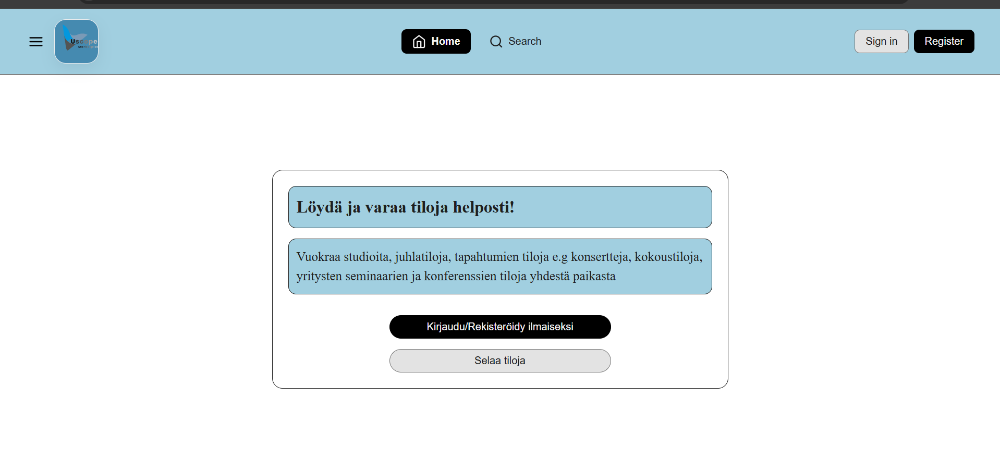

**PublicSideBar:** 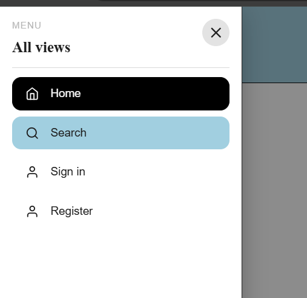

**RegisterForm:** 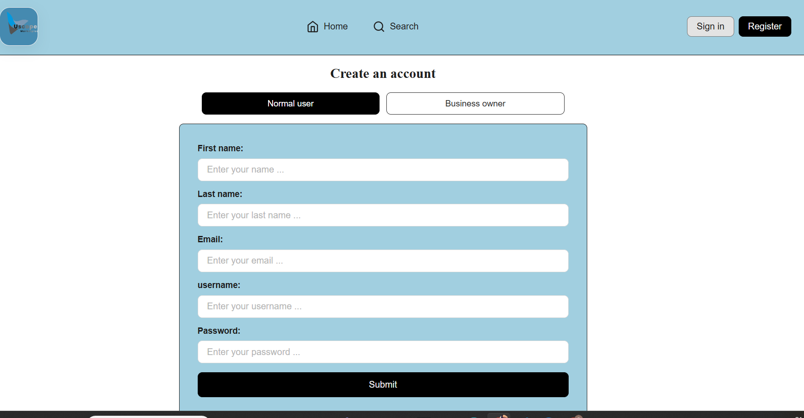

**Authenticated_ClientsHomeView:** 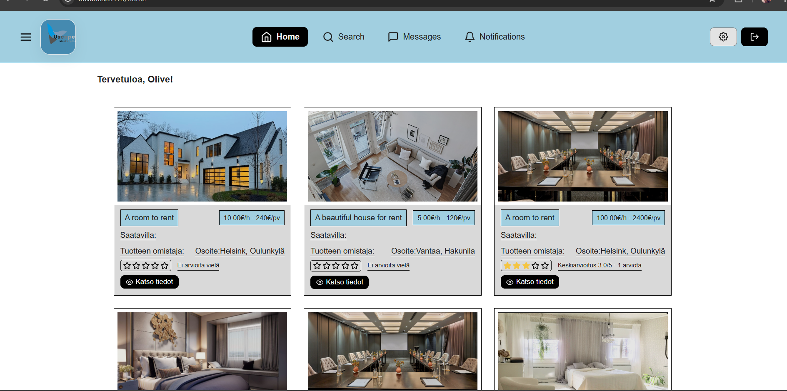

**SidebarforAuthenticatedClients:** 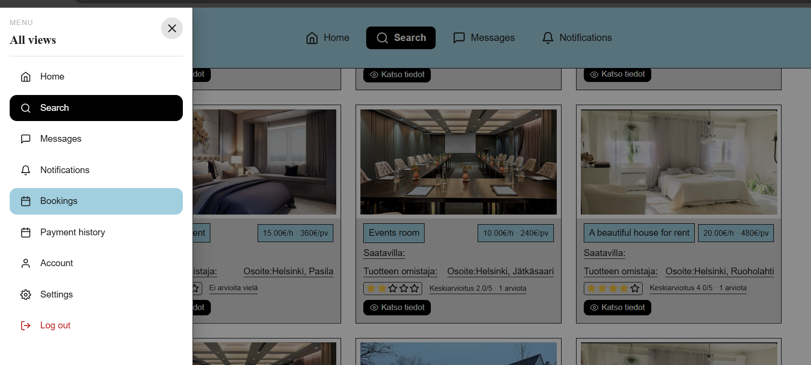

**SearchView:** 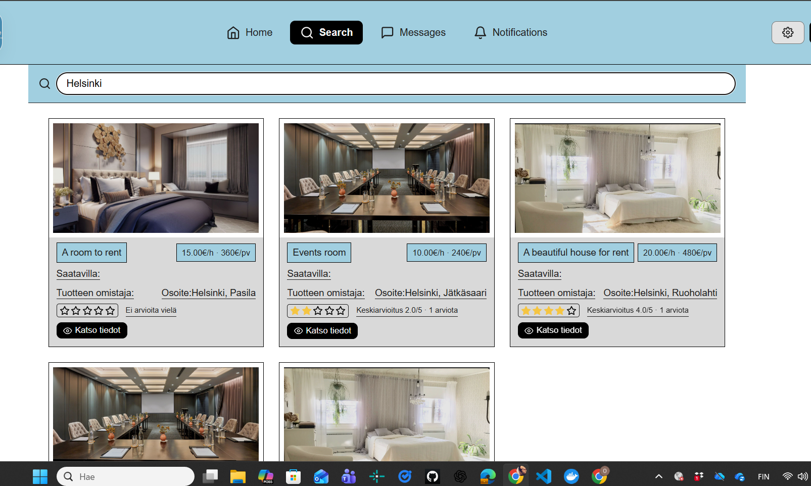

**Singleview:** 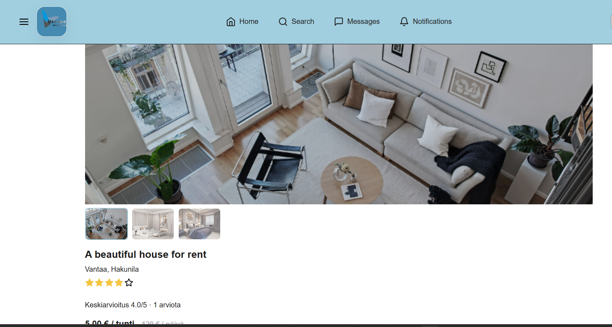

**RatingandBookingView:** 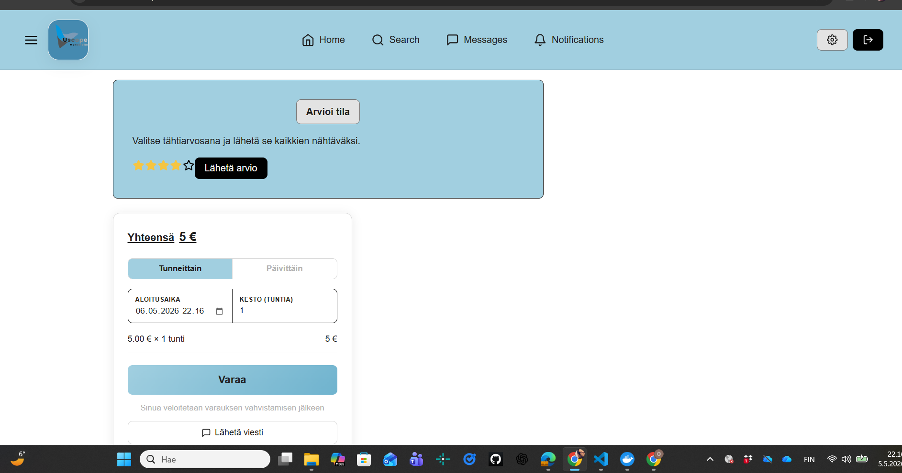

**BookingPopUp:** 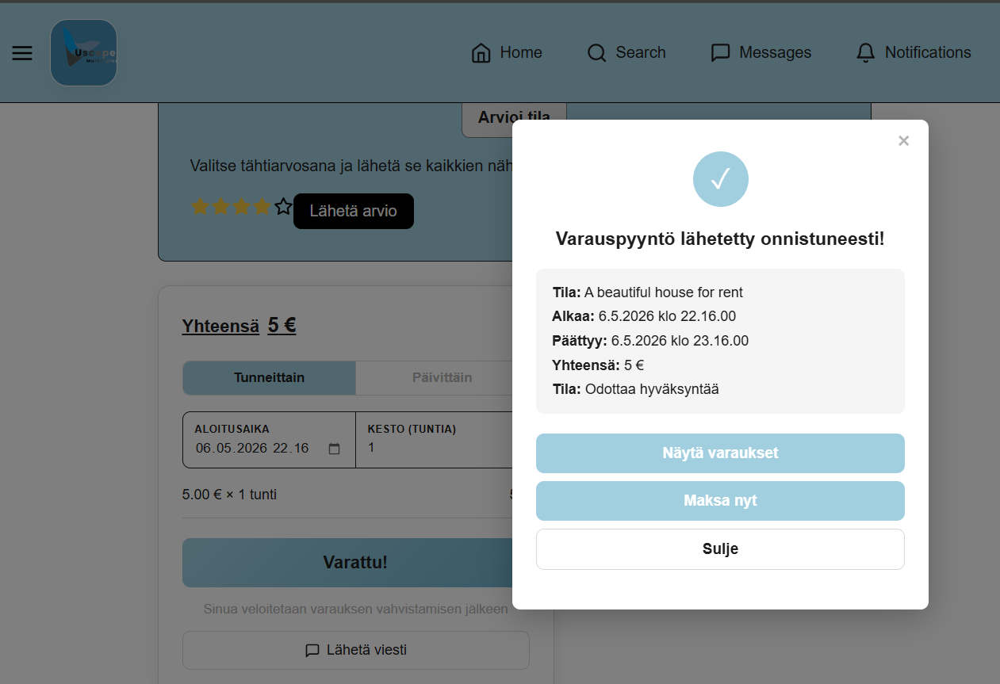

**PaymentsView:** 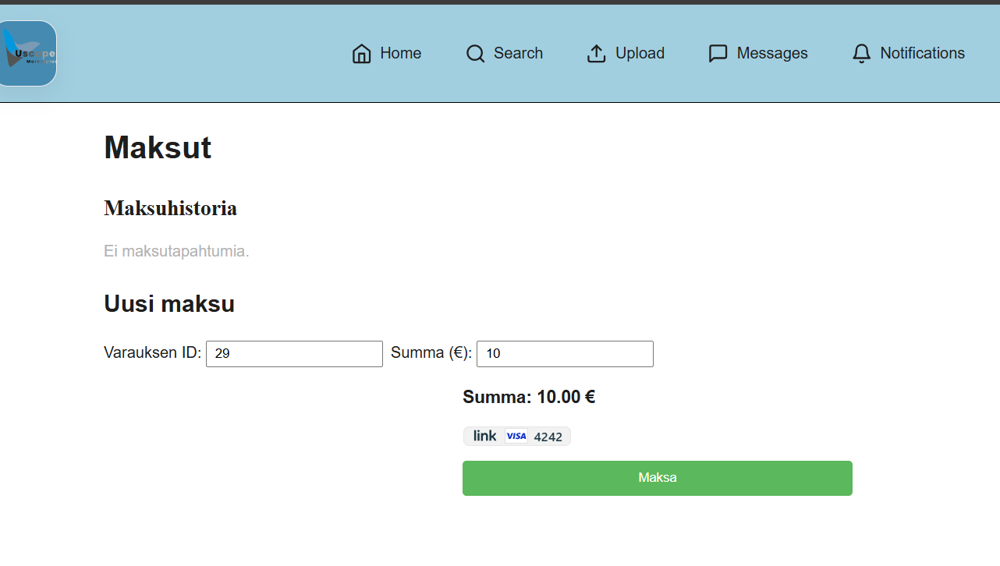

**Payments:** 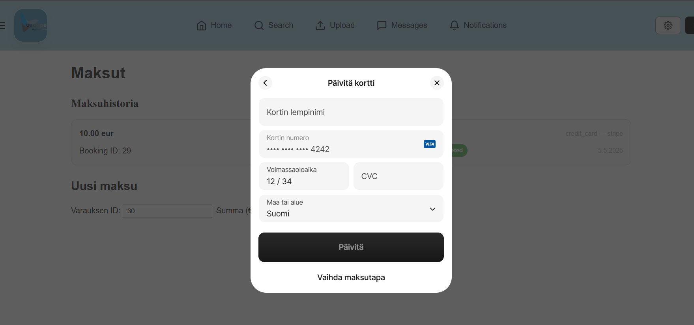

**ClientsAccountView:** 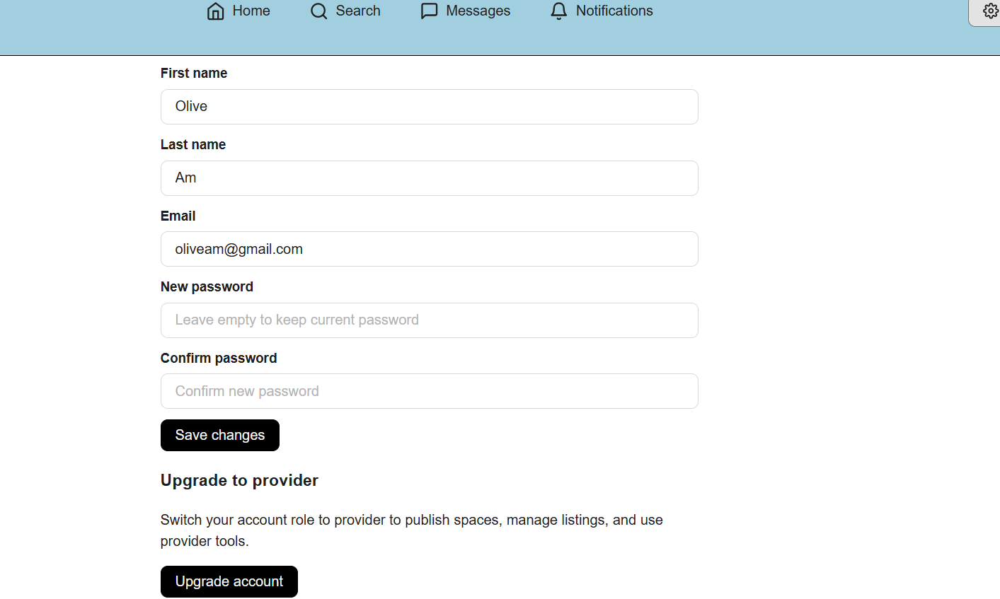

**settings:** 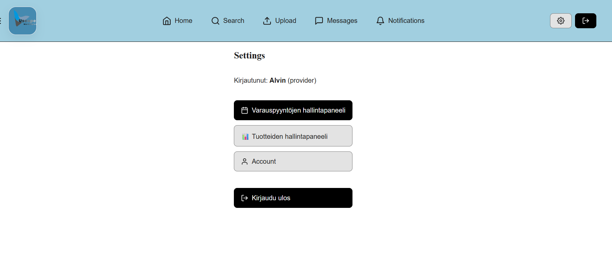

**ServiceProvidersOwnservices:** 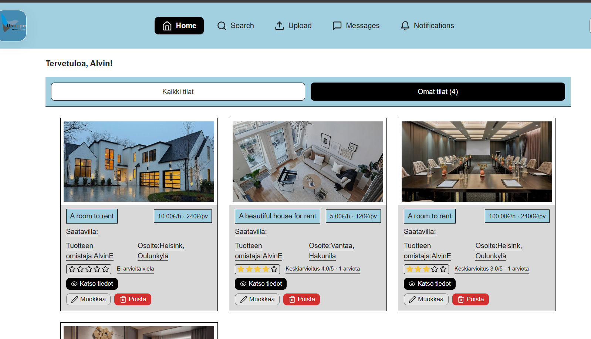

**UploadView:** 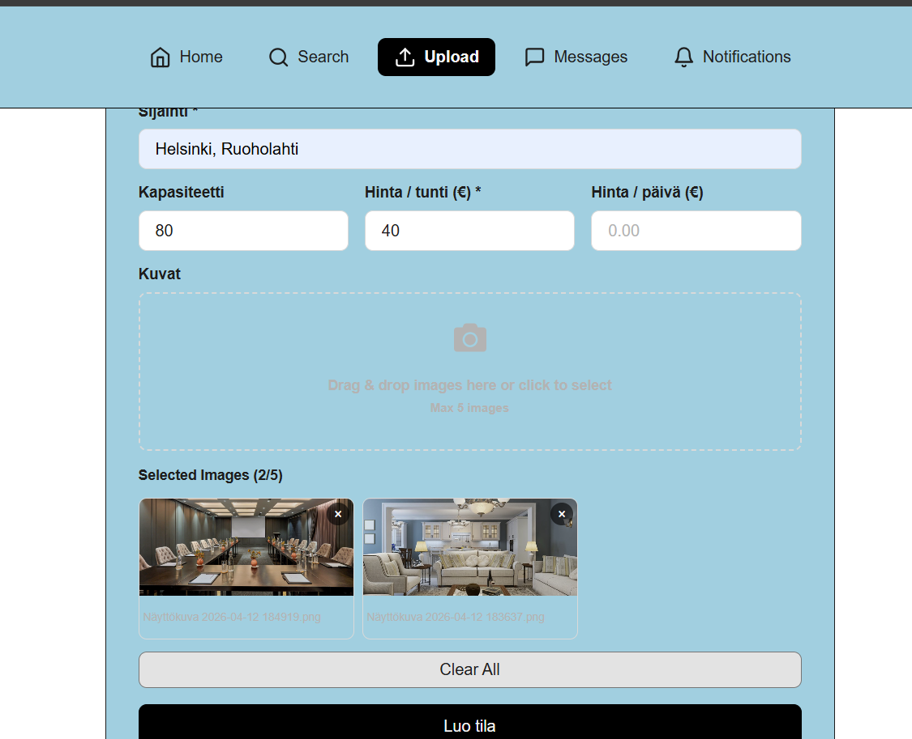

**adminsHomeView:** 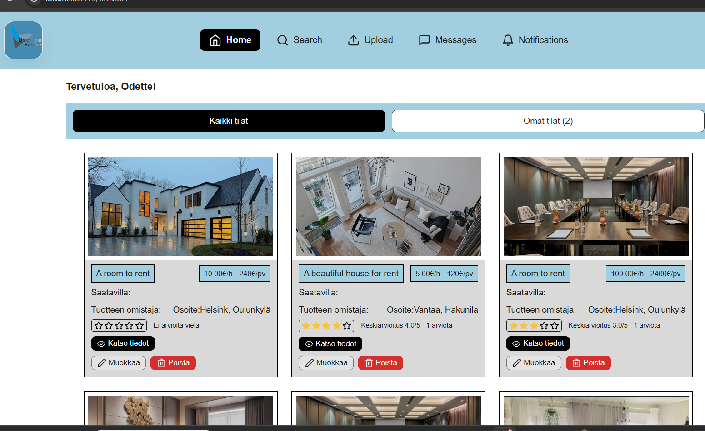

## Installing/updating the shared types package in all servers by running:
- npm install OdetteU23/map-hybridi-types
- npm install OdetteU23/map-hybridi-types --save

## The package can be imported e.g:
- import { User, Space, Category, ... } from 'map-hybrid-types-server';

## Tutorials:
- **Figma design --> Prototype:** https://www.youtube.com/watch?v=1ucLq6JTxac&t=45s
- **Stripe:** https://medium.com/@msmt0452/comprehensive-guide-to-payment-gateways-with-react-84c8880f19ac
- **Stripe docs:** https://docs.stripe.com/development
- **AWS S3 Bucket:** https://aws.amazon.com/video/watch/5c76e13b7fe/ 
- **PostGresql initialization script:** https://www.youtube.com/watch?v=AjNB-yBM5so
- **Redis:** https://www.geeksforgeeks.org/system-design/complete-guide-of-redis-scripting/
- **S3 Client SDK:** https://www.npmjs.com/package/@aws-sdk/client-s3?activeTab=readme
